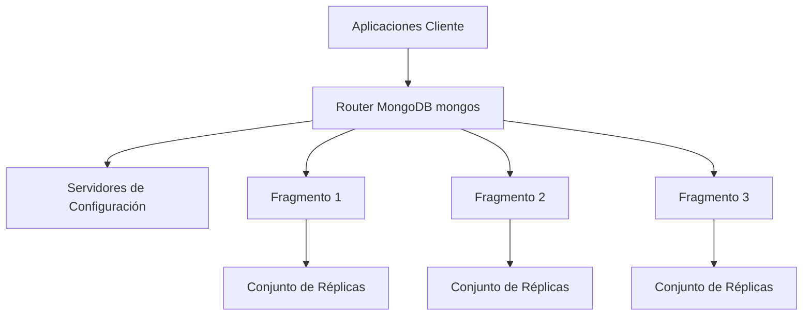
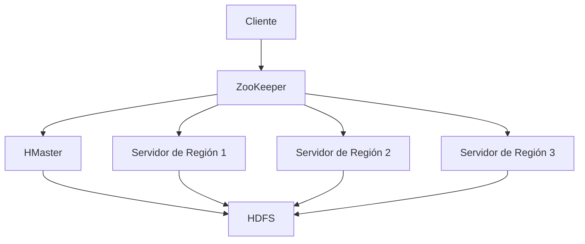

# 📊 MongoDB vs HBase: Una Comparación Exhaustiva


## 📑 Tabla de Contenidos
- [Introducción](#introduccion)
- [Descripción General de MongoDB](#descripcion-general-de-mongodb)
  - [Características Principales](#caracteristicas-principales-mongodb)
  - [Arquitectura](#arquitectura-mongodb)
  - [Casos de Uso](#casos-de-uso-mongodb)
- [Descripción General de HBase](#descripcion-general-de-hbase)
  - [Características Principales](#caracteristicas-principales-hbase)
  - [Arquitectura](#arquitectura-hbase)
  - [Casos de Uso](#casos-de-uso-hbase)
- [Comparación](#comparacion)
- [¿Cuándo Elegir Cuál?](#cuando-elegir-cual)
- [Referencia Rápida](#referencia-rapida)

## Introducción

En el mundo de las bases de datos NoSQL, MongoDB y HBase se destacan como dos soluciones potentes para manejar datos a gran escala. Esta guía proporciona una comparación exhaustiva para ayudarte a entender sus fortalezas y casos de uso.

## Descripción General de MongoDB


MongoDB es una base de datos NoSQL orientada a documentos que almacena datos en documentos flexibles similares a JSON.

### Características Principales de MongoDB

- 📝 Almacenamiento orientado a documentos
- 🔄 Esquema dinámico
- 🔍 Lenguaje de consulta rico
- 📊 Framework de agregación
- 📈 Escalado horizontal mediante fragmentación
- 🔒 Características de seguridad incorporadas

### Arquitectura de MongoDB



### Casos de Uso de MongoDB

- 📱 Aplicaciones móviles
- 🌐 Sistemas de gestión de contenido
- 📊 Análisis en tiempo real
- 🎮 Aplicaciones de juegos
- 🛒 Plataformas de comercio electrónico

## Descripción General de HBase


HBase es un almacén de datos distribuido y escalable construido sobre HDFS (Sistema de Archivos Distribuido de Hadoop).

### Características Principales de HBase

- 📊 Almacenamiento orientado a columnas
- ⚡ Acceso de lectura/escritura en tiempo real
- 🔄 Fragmentación automática
- 💾 Soporte de compresión
- 🔍 Lecturas y escrituras consistentes
- 📈 Escalado lineal y modular

### Arquitectura de HBase



### Casos de Uso de HBase

- 📊 Análisis de big data
- 📈 Datos de series temporales
- 🌐 Procesamiento de datos a gran escala
- 📱 Plataformas de mensajería
- 🔍 Motores de búsqueda

## Comparación

| Característica | MongoDB | HBase |
|----------------|---------|-------|
| Modelo de Datos | Orientado a documentos | Almacén de columnas anchas |
| Lenguaje de Consulta | Lenguaje de consulta rico | Get/Put/Scan |
| Escalado | Horizontal (Fragmentación) | Horizontal (Auto-fragmentación) |
| Consistencia | Configurable | Fuerte |
| Caso de Uso | Propósito general | Big data/Análisis |
| Rendimiento | Alto (CRUD) | Alto (Grandes conjuntos de datos) |
| Curva de Aprendizaje | Moderada | Pronunciada |

## ¿Cuándo Elegir Cuál?

### Elige MongoDB cuando:
- 🎯 Necesites un esquema flexible
- 📝 Tus datos estén orientados a documentos
- 🚀 Quieras un desarrollo más rápido
- 📊 Necesites capacidades de consulta ricas
- 🔄 Tu estructura de datos cambie frecuentemente

### Elige HBase cuando:
- 📈 Tengas conjuntos de datos masivos
- ⚡ Necesites acceso en tiempo real a Big Data
- 📊 Trabajes con datos de series temporales
- 🔍 Necesites una fuerte consistencia
- 💾 Ya estés usando el ecosistema Hadoop

## Referencia Rápida

```javascript
// Ejemplo de MongoDB
db.collection.insertOne({
    nombre: "Producto",
    precio: 99.99,
    detalles: {
        color: "azul",
        tamaño: "mediano"
    }
})
```

```java
// Ejemplo de HBase
Put put = new Put(Bytes.toBytes("fila1"));
put.addColumn(
    Bytes.toBytes("cf"),
    Bytes.toBytes("nombre"),
    Bytes.toBytes("Producto")
);
table.put(put);
```

---

## 📚 Recursos Adicionales

- [Documentación de MongoDB](https://docs.mongodb.com/)
- [Documentación de HBase](https://hbase.apache.org/book.html)
- [Comparación de Bases de Datos NoSQL](https://db-engines.com/en/comparison)

---


> 💡 **Nota**: Este es un documento vivo. ¡Siéntete libre de contribuir y mejorarlo!


gitGraph
    commit
    branch develop
    checkout develop
    commit
    branch feature/nueva-funcionalidad
    checkout feature/nueva-funcionalidad
    commit
    commit
    checkout develop
    merge feature/nueva-funcionalidad
    branch quality/certificacion
    checkout quality/certificacion
    commit
    checkout develop
    merge quality/certificacion
    branch release/1.0.0
    checkout release/1.0.0
    commit
    checkout main
    merge release/1.0.0 tag:"v1.0.0"
    checkout develop
    merge release/1.0.0
    branch hotfix/1.0.1
    checkout hotfix/1.0.1
    commit
    checkout main
    merge hotfix/1.0.1 tag:"v1.0.1"
    checkout develop
    merge hotfix/1.0.1
